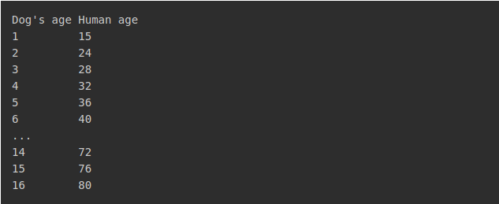

The following table shows dog's age mapped to the corresponding human age. 

Write a Python program, dog_age.py, which reads dog's age (integer) with the prompt "Input dog's age: " and writes out the corresponding human age.  If the entered dog's age does not match an entry in the table, then the program should write out: "Invalid age